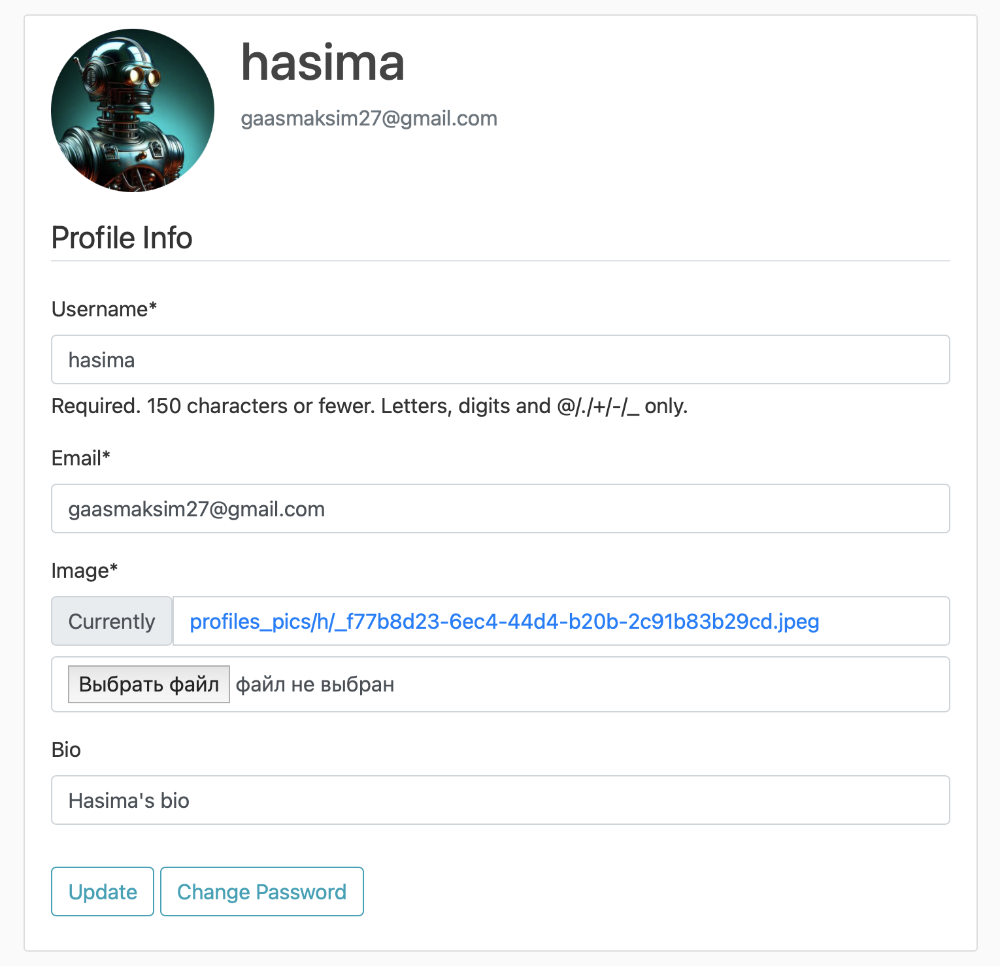
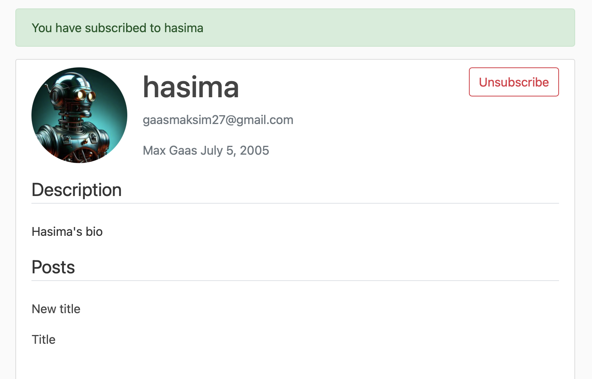
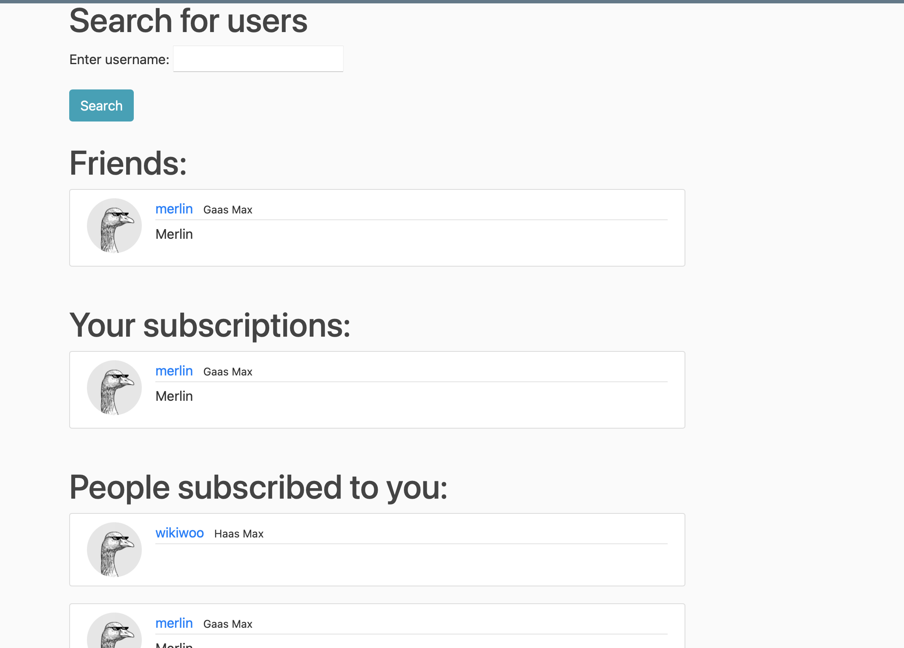
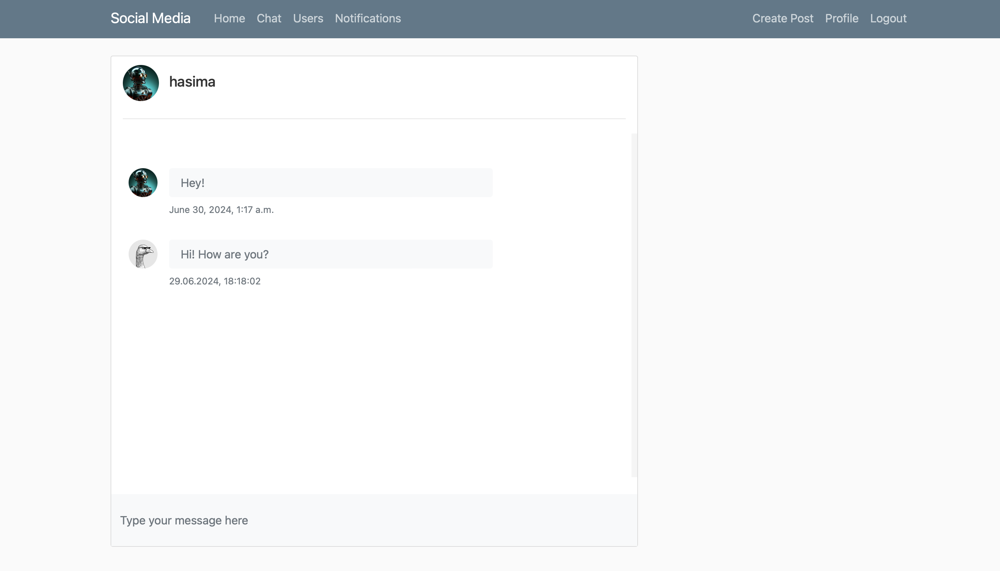
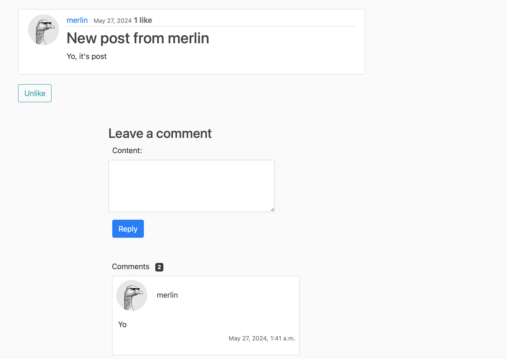
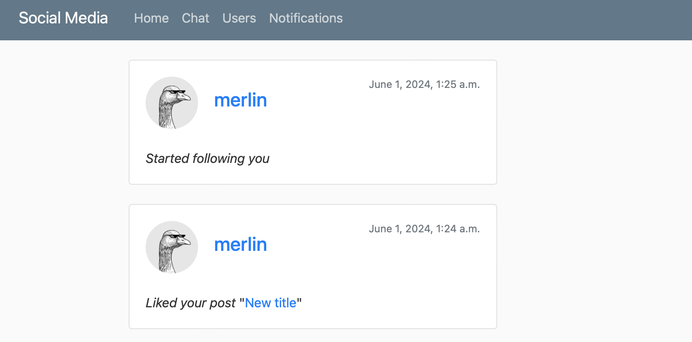

# Social Media Project

### Описание проекта

Этот учебный проект представляет собой веб-приложение социальной сети.

### Основные функции

- Аутентификация пользователей: регистрация, вход, выход

- Профиль пользователя с загрузкой аватара

    

- Взаимодействие с другими пользователями

    

    

- Обмен личными сообщениями в реальном времени с поддержкой WebSocket

    

- Создание, удаление и редактирование постов с использованием CKEditor

- Комментарии и лайки

    

- Уведомления

    

### Основные технологии

- Django
- DRF (Django Rest Framework)
- Django Channels
- Postgresql
- Redis (для кэширования часто запрашиваемых данных)
- Bootstrap5, CSS, JS
